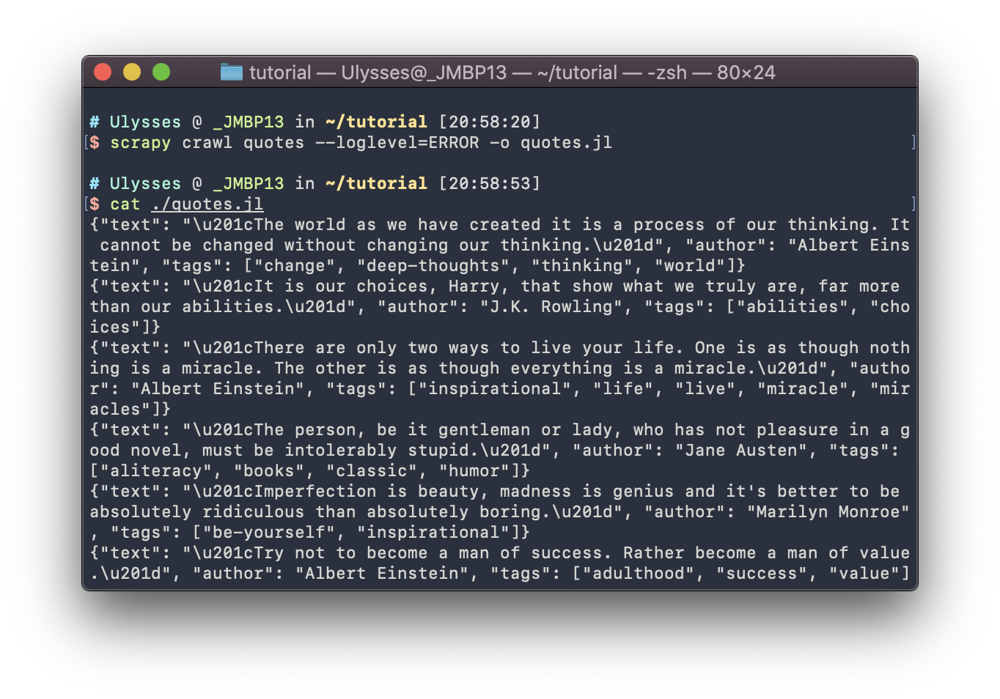

<center style = "font-size: 4em">金融科技导论实验报告</center><br/><br/><br/><br/>

**姓名**：<u>陈希尧</u>

**学号**：<u>3180103012</u>

**专业**：<u>计算机科学与技术</u>

**课程名称**：<u>金融科技导论</u>

<center style = "font-size: 1.7em">Table of Contents</center>

[TOC]

# 环境配置

## Python环境

使用系统自带的python 3.7.7

* 使用`which`命令查看python3和pip3位置
    * 需先将pip3的alias写进.xxshrc，否则需使用`python3 -m pip`来调用PyPl模块
* 输入`python3 --version`检查当前版本
* 检查pip.conf文件中的pip源是否已更换


## 编辑器环境

日常写python的三种环境如下：

* 使用vim，不额外安装插件
* 使用vscode，安装python支持扩展以及Autopep8以支持格式化
* 使用Sublime Text，安装SublimeREPL以支持python的直接运行

# Scrapy框架的安装

输入`pip3 install Scrapy`或`python3 -m pip install Scrapy`即可安装


确认安装成功：


# Demo的编写

## 抓取数据

创建工程


写入Spiders，直接用vim，代码如下

```python
import scrapy

class QuotesSpider(scrapy.Spider):
    name = "quotes"

    def start_requests(self):
        urls = [
            'http://quotes.toscrape.com/page/1/',
            'http://quotes.toscrape.com/page/2/',
        ]
        for url in urls:
            yield scrapy.Request(url=url, callback=self.parse)

    def parse(self, response):
        page = response.url.split("/")[-2]
        filename = 'quotes-%s.html' % page
        with open(filename, 'wb') as f:
            f.write(response.body)
        self.log('Saved file %s' % filename)
```


运行。注意，要在项目根目录下运行才有crawl这个option。


换一种方式实现Spider

```python
import scrapy

class QuotesSpider(scrapy.Spider):
    name = "quotes"
    start_urls = [
        'http://quotes.toscrape.com/page/1/',
        'http://quotes.toscrape.com/page/2/',
    ]

    def parse(self, response):
        page = response.url.split("/")[-2]
        filename = 'quotes-%s.html' % page
        with open(filename, 'wb') as f:
            f.write(response.body)
```

此处不需要设置回调函数，因为parse是scrapy默认的回调函数

## 解析数据

在项目目录下输入`scrapy shell 'http://quotes.toscrape.com/page/1/'`


进行一些简单的query，包括正则匹配


XPath的使用


**提取引用和作者**

输入`scrapy shell 'http://quotes.toscrape.com'`

输入`response.css("div.quote")`后，由于重复会有很多信息，因此只提取第一个，输入`response.css("div.quote")[0]`可以确认该信息

将该信息赋值给quote变量，然后提取quote的内容


也可以用循环批量打印内容


重新修改Spider以实现相同的效果，`vim ./tutorial/spiders/quotes_spider.py`，输入以下代码：

```python
import scrapy

class QuotesSpider(scrapy.Spider):
    name = "quotes"
    start_urls = [
        'http://quotes.toscrape.com/page/1/',
        'http://quotes.toscrape.com/page/2/',
    ]

    def parse(self, response):
        for quote in response.css('div.quote'):
            yield {
                'text': quote.css('span.text::text').get(),
                'author': quote.css('small.author::text').get(),
                'tags': quote.css('div.tags a.tag::text').getall(),
            }
```


运行`scrapy crawl quotes`


## 存储数据

以json格式保存


以jl格式保存



以xml格式保存


## 递归爬取

 教程中有两种方法，这里使用第二种较为简单的使用`response.follow`的方法。

```python
import scrapy


class QuotesSpider(scrapy.Spider):
    name = "quotes"
    start_urls = [
        'http://quotes.toscrape.com/page/1/',
    ]

    def parse(self, response):
        for quote in response.css('div.quote'):
            yield {
                'text': quote.css('span.text::text').get(),
                'author': quote.css('span small::text').get(),
                'tags': quote.css('div.tags a.tag::text').getall(),
            }

        next_page = response.css('li.next a::attr(href)').get()
        if next_page is not None:
            yield response.follow(next_page, callback=self.parse)
```

通过css`'li.next a::attr(href)'`获得下一页的连接，然后用`response.follow`跳转。

另一种方法是：

```python
next_page = response.css('li.next a::attr(href)').get()
if next_page is not None:
    next_page = response.urljoin(next_page)
    yield scrapy.Request(next_page, callback=self.parse)
```

# Bonus

> 爬取网贷之家的银行理财产品信息，网址为[https://www.wdzj.com/bank/](https://www.wdzj.com/bank/)


创建工程，`scrapy startproject WDZJ          `

修改item.py为需要的数据项，分别为：产品名，利率，期限

```python
class WdzjItem(scrapy.Item):
    productName = scrapy.Field()
    interestRate = scrapy.Field()
    term = scrapy.Field()
```

对应的，登入localhost的mysql-server创建数据库和表：

```mysql
mysql> create database WDZJ_DB;
Query OK, 1 row affected (0.13 sec)

mysql> use WDZJ_DB;
Database changed

mysql> create table product(productName char(20), interestRate char(20), term char(20));
Query OK, 0 rows affected (0.06 sec)
```

由于网贷之家有反爬虫设置，需要进入setting.py进行如下修改：

```python
ROBOTSTXT_OBEY = False
USER_AGENT = 'SC (+http://www.scottchen.com)'
```

创建Spider，将类设置为如下内容，通过较为熟悉的xpath进行匹配。需要注意的是由于网贷之家的利率这一项的文本是自带\n和\s的，因此需要通过正则匹配将多余的字符去掉，最后yield将数据传给管道。

```python
class wdzjSpider(scrapy.Spider):
    name = "wdzj"
    allowed_domains = ["wdzj.com"]
    start_urls = [
        "https://www.wdzj.com/bank/",
    ]

    def parse(self, response):
        # filename = response.url.split("/")[-2] + '.html'
        selector = Selector(text=response.body)

        productName = selector.xpath('//div[@class="bank-col bank-title"]/text()').getall()
        raw_interestRate = selector.xpath('//div[@class="bank-col w100"]//div[@class="bank-value color-red"]/text()').getall()
        term = selector.xpath('//div[@class="tip-box"]//span/text()').getall()

        print(type(raw_interestRate[0]))
        for i in range(len(raw_interestRate)):
            raw_interestRate[i] = re.sub("\n\s+", "", raw_interestRate[i])
        interestRate = []
        for i in raw_interestRate:
            if i != '':
                interestRate.append(i)

        print(productName)
        print(interestRate)
        print(term)

        with open('wdzj_bank.html', 'wb') as f:
            f.write(response.body)
        # for quote in response.css('div.quote'):
        for i in range(len(term)):
            yield {
                'productName': productName[i],
                'interestRate': interestRate[i],
                'term': term[i],
            }
```

进入管道，进行如下修改：

```python
from twisted.enterprise import adbapi
import MySQLdb
import MySQLdb.cursors
import codecs
import json
from logging import log
from itemadapter import ItemAdapter

class WdzjPipeline(object):
    def __init__(self):
        self.dbpool = adbapi.ConnectionPool('MySQLdb',
                                            host='127.0.0.1',
                                            db='WDZJ_DB',
                                            user='root',
                                            passwd='',
                                            cursorclass=MySQLdb.cursors.DictCursor,
                                            charset='utf8',
                                            use_unicode=False)

    def process_item(self, item, spider):
        query = self.dbpool.runInteraction(self._conditional_insert, item)
        query.addErrback(self._handle_error, item, spider)
        return item

    def _conditional_insert(self, tx, item):
        sql = "insert into product values(%s, %s, %s)"
        params = (item["productName"], item["interestRate"], item["term"])
        tx.execute(sql, params)

    def _handle_error(self, failue, item, spider):
        print("ERROR")
```

通过MySQLdb包和adbapi的功能，首先创建一个类成员，作为到本机数据库的一个连接。之后修改默认的`process_item`方法，在其中调用对数据库的插入方法`_conditional_insert`

然后在进入setting.py开启管道：

```python
ITEM_PIPELINES = {
   'WDZJ.pipelines.WdzjPipeline': 300,
}
```

修改完毕后在终端中`scrapy crawl wdzj --loglevel=WARNING`，结果如下：


此时数据库中的内容变为：


已抓取成功。(由于网贷之家本身的数据就只有七条因此这里体现不出爬虫在数据获取上的优越性🐶)

# 实验心得

由于有python的基础，本实验的基础部分对我来说并不困难，依照doc一步一步来即可完成，并且在完成的同时需要深入理解Scrapy的处理机制。

Bonus的实现就比较有挑战性了，我遇到了主要困难如下：

* 无法获得网页内容，连html都拿不到：因为网贷之家有反爬虫设置，在我设置了不遵循Robots协议并设置了代理之后才能正常爬取网页数据
* 管道不被调用，连构造函数都不被调用：没有在设置中打开管道
* 管道中的`process_item`方法不被调用：在Spider的`parse`方法中没有yield爬取到的数据

此外还有其他的一些困难，查阅了许多资料之后才得以解决，但是在这个过程中我已经熟练掌握了Scrapy框架的使用方式。