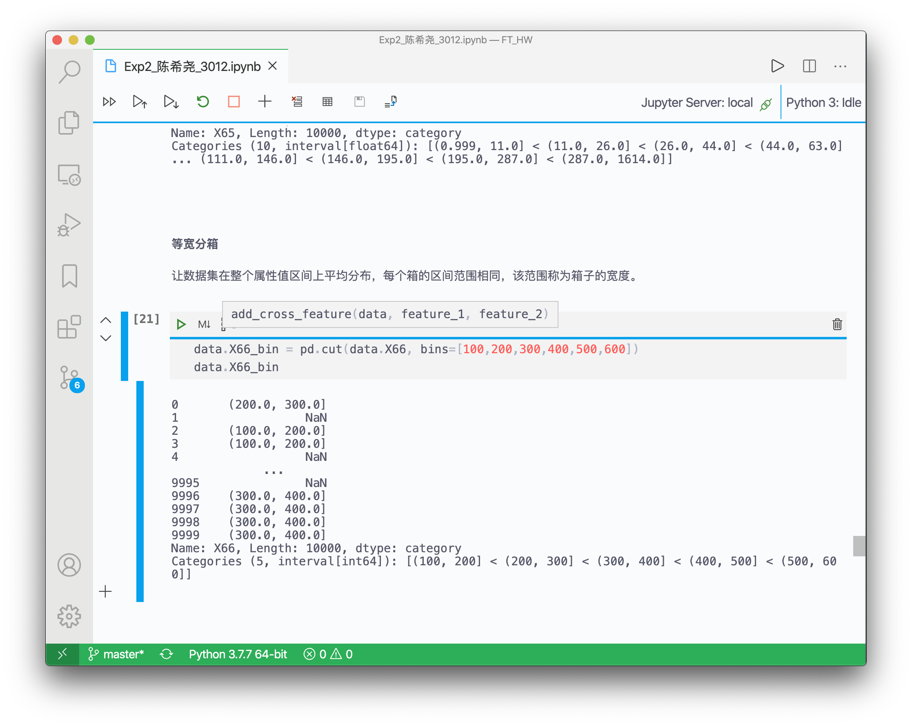

金融科技导论实验报告
    

**姓名**：<u>陈希尧</u>

**学号**：<u>3180103012</u>

**专业**：<u>计算机科学与技术</u>

**课程名称**：<u>金融科技导论</u>

Table of Contents

[TOC]

# 环境配置

检查需要的包的安装情况

Notebook使用VS Code原生的内嵌Jupyter环境，其中的Jupyter Notebook使用pip安装而非conda自带。

# 实验步骤

## 导入相关包

其中matplotlib和seaborn是用于数据可视化的

## 数据读取

### 读取原始训练集

### 读取数据集属性信息

### 整合数据集的行列信息

## 观察测试集

### 缺失情况

### 数据特征(关联性可视化)

效果如下：

## 缺失数据处理

注意：在修改测试集时不能调用测试集本身的数据

### 默认值填充

### 平均值填充

### 删除不完整的行

## 数据变化与离散化

### 缩放

### 规范化

### 离散化

#### 等深分箱

#### 等宽分箱

## 特征构造

先看原数据

实现特征交叉方法并查看结果

## 数据集切分

# 实验心得

经过本次实验，我初步窥探得了数据预处理的基本步骤，学习了Pandas，Numpy等数据分析包的使用，并巩固了对mtaplotlib和seaborn可视化包的掌握。相信本次实验对之后的学习很有帮助。