<center style = "font-size: 4em">金融科技导论实验报告</center><br/><br/><br/><br/>

**姓名**：<u>陈希尧</u>

**学号**：<u>3180103012</u>

**专业**：<u>计算机科学与技术</u>

**课程名称**：<u>金融科技导论</u>

<center style = "font-size: 1.7em">Table of Contents</center>

[TOC]

# 环境配置

检查所需的包

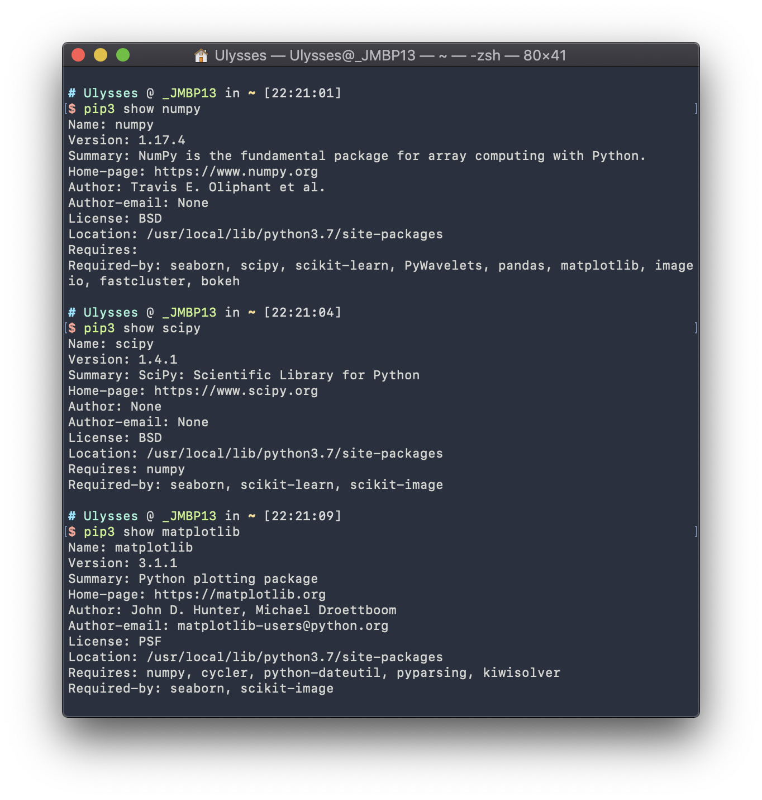

# 聚类算法

## 方法实现

### k-means

在kmeans函数下实现k-means或k-medoids算法

**实现思路**：

1. 在样本中随机选取k个样本点充当各个簇的中心点$\{\mu_{1},\mu_{2},...,\mu_{k}\}$
    * 为了尽可能合理化，我选取的中心点并非样本点而是空间中任意点，且随机的分布采用正态分布
2. 计算所有样本点与各个簇中心之间的距离$dist(x^{(i)},\mu_{j})$，然后把样本点划入最近的簇中$x^{(i)}\in{\mu_{nearest}}$
3. 根据簇中已有的样本点，重新计算簇中心$\mu_{i}:=\frac{1}{|C_{i}|}\sum_{x\in{C{i}}}x$

```python
def kmeans(X, k):
    '''
    K-Means clustering algorithm

    Input:  x: data point features, N-by-P maxtirx
            k: the number of clusters

    OUTPUT:  idx: cluster label, N-by-1 vector
    '''

    N, P = X.shape
    idx = np.zeros(N)
    # YOUR CODE HERE
    # ----------------
    # ANSWER BEGIN
    # ----------------

    # Normal Distribution
    centers = np.random.randn(k, P) * np.std(X, axis=0) + np.mean(X, axis=0)

    # Random
    # rand_array = np.arange(0, N)
    # np.random.shuffle(rand_array)
    # centers = np.zeros((k, P))
    # centers = X[rand_array[:k], :]

    pre_centers = np.zeros((k, P))
    centers_move = 1.0
    min_move = 1E-9
    dist = np.zeros((N, k))  # N points, each has k dist to k centers

    while centers_move > min_move:  # Convergence is fast enough
        for iCenter in range(k):
            dist[:, iCenter] = np.linalg.norm(X-centers[iCenter], axis=1)

        idx = np.argmin(dist, axis=1)  # In Dimension of k centers

        pre_centers = centers.copy()   # Very important... Don't forget the shallow copy

        for iCenter in range(k):
            # In Dimension of N points
            centers[iCenter] = np.mean(X[idx == iCenter], axis=0)

        centers_move = np.sum(np.linalg.norm(
            centers[i] - pre_centers[i]) for i in range(k))

    # ----------------
    # ANSWER END
    # ----------------
    return idx
```

### 谱聚类

在spectral函数下实现谱聚类算法

**实现思路**：

1. 数据准备，生成图的邻接矩阵
2. 归一化普拉斯矩阵；
    * $D^{-1}L$
3. 生成最小的k个特征值和对应的特征向量
    * 先获得所有的特征值和特征向量然后排序取得最小的k个
    * 获得N*k的特征矩阵
4. 将特征向量kmeans聚类(少量的特征向量)
    * 将矩阵每一行作为一个k维的样本，共N个样本，调用K-means方法

```python
def spectral(W, k):
    '''
    Spectral clustering algorithm

    Input:  W: Adjacency matrix, N-by-N matrix
            k: number of clusters

    Output:  idx: data point cluster labels, N-by-1 vector
    '''
    N = W.shape[0]
    idx = np.zeros((N, 1))
    # YOUR CODE HERE
    # ----------------
    # ANSWER BEGIN
    # ----------------

    DegMat = np.diag(np.sum(W, axis=1))

    LapMat = DegMat - W

    eigValues, eigVectors = np.linalg.eig(np.dot(np.linalg.inv(DegMat), LapMat))  # invD(D-W)

    dim = len(eigValues)
    dictEigValues = dict(zip(eigValues, range(dim)))
    ix = [dictEigValues[i] for i in np.sort(eigValues)[0:k]]
    X = eigVectors[:, ix]

    # ----------------
    # ANSWER END
    # ----------------
    X = X.astype(float)
    idx = kmeans(X, k)
    return idx
```

## 调试与优化

### 优化谱聚类效果

**调试knn_graph的参数，优化谱聚类的效果**

进入plot.py将`plt.show()`修改为`plt.savefig(title + '.svg', format='svg')`便于之后的测试

将cluster.py主程部分修改为：

```python
idx = kmeans(X, 2)
plot(X, idx, "Clustering-kmeans")

W = knn_graph(X, 10, 1.0)
idx = spectral(W, 2)
plot(X, idx, "Clustering-Spectral_10_1.0")

W = knn_graph(X, 15, 1.0)
idx = spectral(W, 2)
plot(X, idx, "Clustering-Spectral_15_1.0")

W = knn_graph(X, 20, 1.0)
idx = spectral(W, 2)
plot(X, idx, "Clustering-Spectral_20_1.0")

W = knn_graph(X, 10, 1.45)
idx = spectral(W, 2)
plot(X, idx, "Clustering-Spectral_10_1.45")

W = knn_graph(X, 15, 1.45)  # recommend parameters
idx = spectral(W, 2)
plot(X, idx, "Clustering-Spectral_15_1.45")

W = knn_graph(X, 20, 1.45)
idx = spectral(W, 2)
plot(X, idx, "Clustering-Spectral_20_1.45")

W = knn_graph(X, 10, 2.0)
idx = spectral(W, 2)
plot(X, idx, "Clustering-Spectral_10_2.0")

W = knn_graph(X, 15, 2.0)
idx = spectral(W, 2)
plot(X, idx, "Clustering-Spectral_15_2.0")

W = knn_graph(X, 20, 2.0)
idx = spectral(W, 2)
plot(X, idx, "Clustering-Spectral_20_2.0")
```

结果

k: number of nearest neighbour.

threshold: distance threshold.

| threshold👉<br />k👇 | 1.0                                                   | 1.45                                                   | 2.0                                                   |
| ------------------ | ----------------------------------------------------- | ------------------------------------------------------ | ----------------------------------------------------- |
| 10                 |  |  | 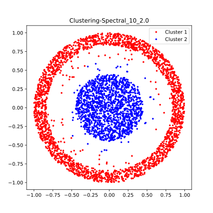 |
| 15                 |  |  | 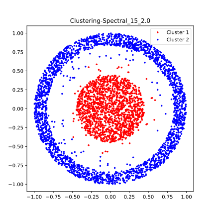 |
| 20                 | 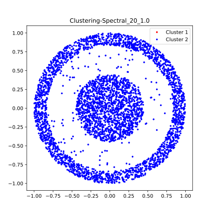 |  |  |

可见在测试的这几种结果中，(k, threshold)取值为(20, 1.0)的这组无法正常聚类(考虑到随机性，我重复多次实验，但结果均不正常)，其他均能正常聚类，且效果相近，难以用肉眼比较出好坏。

### 结果分析

**运行clustering.py文件，保存两种算法的聚类结果，比较分析其不同**

谱聚类的结果都在上面了，K-means的结果如下：

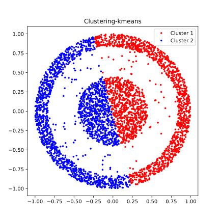

可以看出数据点被均分成两部分了。

对比之下，显然谱聚类的效果要更好，因为K-means的结果只能是凸集，所以不可能对这种环形的数据集进行聚类，在这种情况下就需要谱聚类了。

**两者区别**

+ K-means:
    - 简单快速 (思想很简单易懂）
    - 聚类结果在向量空间为球状（凸集）
    - 聚类结果易受到起始点影响
    - 聚类结果易受到噪声（脏数据）影响
+ Spectral Clustering
    - 相对来说更复杂缓慢
    - 能在任意形状的样本空间上得到较好的聚类效果（如示例中的同心圆情况）
    - 利用了图论的思想和其他的聚类算法（例如k-means），优化了聚类效果

# 分类算法

## 方法实现

### 线性回归

通过线性回归的方法拟合获得权重

实现如下：

```python
def func_lin(X, y):
    '''
    Classification algorithm.

    Input:  X: Training sample features, P-by-N
            y: Training sample labels, 1-by-N

    Output: w: learned perceptron parameters, (P+1)-by-1
    '''
    P, N = X.shape
    w = np.zeros((P+1, 1))

    # YOUR CODE HERE
    # ----------------
    # ANSWER BEGIN
    # ----------------

    x = np.vstack((np.ones((1, X.shape[1])), X))
    w = np.matmul(np.matmul(np.linalg.inv(np.matmul(x, x.T)), x), y.T)

    # ----------------
    # ANSWER END
    # ----------------
    return w
```

### SVM

调用scipy.optimize的minimize方法来实现非线性规划，其中`fun=lambda w : 0.5 * np.linalg.norm(w[1:,]) * np.linalg.norm(w[1:,])`是求最小值的目标函数，`x0=w`是变量的初始猜测值，`constraints`是约束条件，针对fun中为参数的部分(即w)进行约束限制，`method`是求极值的方法，此处用常用的SLSQP

实现如下：

```python
def func_SVM(X, y):
    '''
    Classification algorithm.

    Input:  X: Training sample features, P-by-N
            y: Training sample labels, 1-by-N

    Output: w: learned perceptron parameters, (P+1)-by-1
    '''
    P, N = X.shape
    w = np.zeros((P+1, 1))

    # YOUR CODE HERE
    # ----------------
    # ANSWER BEGIN
    # ----------------

    x_i = np.vstack((np.ones((1, N)), X))
    con = {'type': 'ineq', 'fun': lambda w, X, y: np.multiply(y[0, :], np.matmul(w.T, X)) - 1, 'args': (x_i, y)}
    res = minimize(fun=lambda w : 0.5 * np.linalg.norm(w[1:,]) * np.linalg.norm(w[1:,]), x0=w, constraints=con, method='SLSQP')
    w = res.x.reshape(3, 1)

    # ----------------
    # ANSWER END
    # ----------------
    return w
```

### 感知机

思路很简单，即每次计算加权和与结果比较，如果不符合则在原来的各项权重基础上加上对应的$X_iy$

实现如下：

```python
def func_per(X, y):
    '''
    Classification algorithm.

    Input:  X: Training sample features, P-by-N
            y: Training sample labels, 1-by-N

    Output: w: learned perceptron parameters, (P+1)-by-1
    '''
    P, N = X.shape
    w = np.zeros((P+1, 1))

    # YOUR CODE HERE
    # ----------------
    # ANSWER BEGIN
    # ----------------

    dim = 1
    for iD in range(dim):
        for iN in range(N):
            y_try = w[0][0]
            for iP in range(P):
                y_try += X[iP][iN] * w[iP+1][0]
            if((y_try * y[0][iN]) <= 0):  # Unmatch
                w[0][0] += y[0][iN]
                for j in range(P):        # Update all weights
                    w[j+1][0] += X[j][iN] * y[0][iN]

    # ----------------
    # ANSWER END
    # ----------------
    return w
```

### 测试器

测试器的主要任务是计算错误率，而是否错误的判断是通过逐个比较测试点的实际结果是否与预测结果相同进行的

实现如下：

```python
train_err = 0
test_err = 0
for j in range(no_train):
    if((X_train[0][j] * w_g[1][0] + X_train[1][j] * w_g[2][0] + w_g[0][0]) * y_train[0][j] <= 0):
        train_err = 1
        break

for j in range(no_test):
    if((X_test[0][j] * w_g[1][0] + X_test[1][j] * w_g[2][0] + w_g[0][0]) * y_test[0][j] <= 0):
        test_err = 1
        break
```

## 实验结果

### 线性回归


| No_train/No_test                                             | **1:9**                                                      | **2:8**                                                      | **3:7**                                                      | **4:6**                                                      |
| ------------------------------------------------------------ | ------------------------------------------------------------ | ------------------------------------------------------------ | ------------------------------------------------------------ | ------------------------------------------------------------ |
| train_err/test_err                                           | 0.926/0.998                                                  | 0.978/0.998                                                  | 0.980/0.998                                                  | 0.994/0.996                                                  |
| Result                                                       | 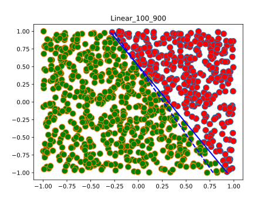 | 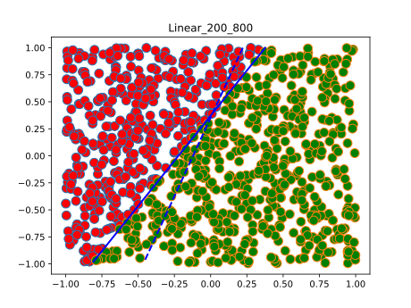 | 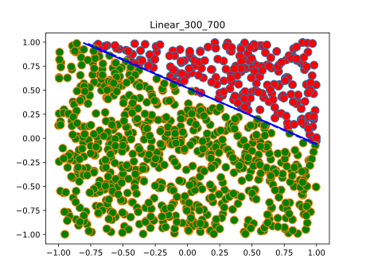 | 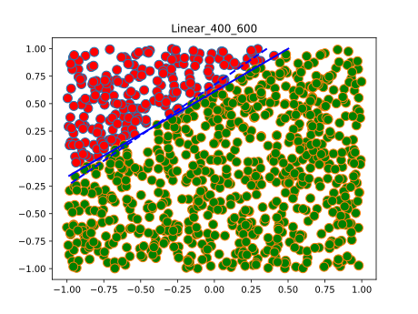 |
| **5:5**                                                      | **6:4**                                                      | **7:3**                                                      | **8:2**                                                      | **9:1**                                                      |
| 0.994/0.998                                                  | 0.994/0.984                                                  | 0.996/0.980                                                  | 0.998/0.970                                                  | 0.998/0.896                                                  |
| 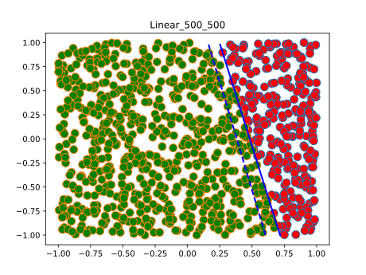 | 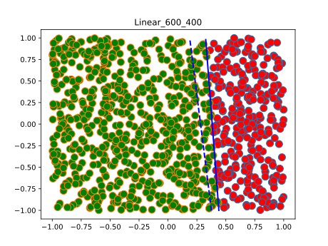 | 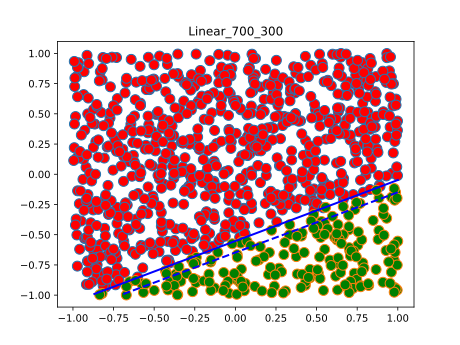 | 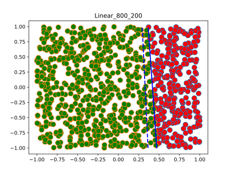 | 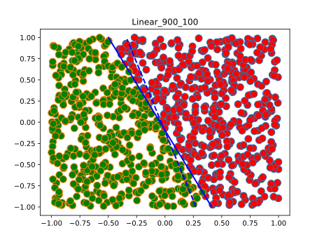 |

与之后的方法相比，效果比较不理想，7/3的时候也没有更好，和其他的效果其实也差不多，两者的错误率随着各自的占比的下降而下降。

### SVM

**500次迭代下不同划分的实验结果**

| No_train/No_test                                           | **1:9**                                                    | **2:8**                                                    | **3:7**                                                    | **4:6**                                                    |
| ---------------------------------------------------------- | ---------------------------------------------------------- | ---------------------------------------------------------- | ---------------------------------------------------------- | ---------------------------------------------------------- |
| train_err/test_err                                         | 0/0.952                                                    | 0/0.898                                                    | 0/0.758                                                    | 0/0.666                                                    |
| Result                                                     | 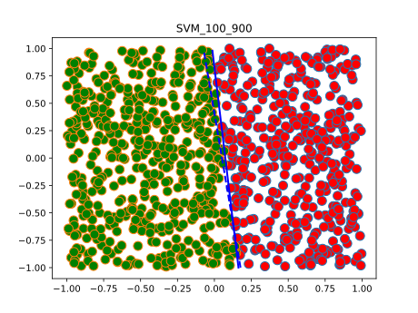 | 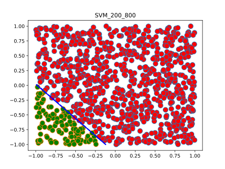 | 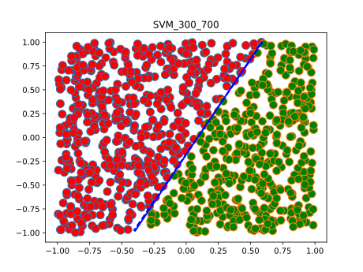 | 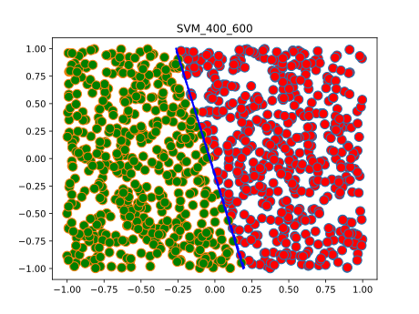 |
| **5:5**                                                    | **6:4**                                                    | **7:3**                                                    | **8:2**                                                    | **9:1**                                                    |
| 0/0.560                                                    | 0/0.478                                                    | 0/0.350                                                    | 0/0.248                                                    | 0/0.108                                                    |
| 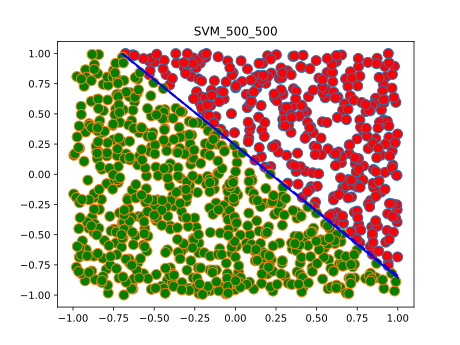 | 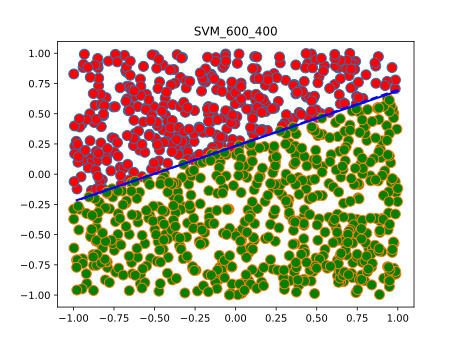 | 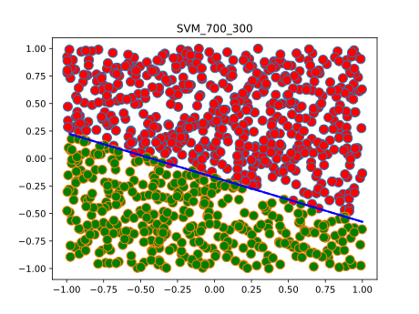 | 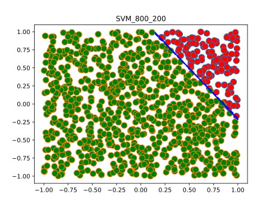 | 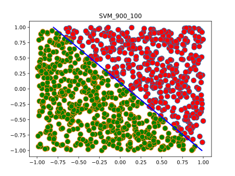 |

当训练集与测试集的数据量之比超过3/7时基本上就看不出区别了，但实际上这个比值越大效果越好，因为错误率会越低。两者的错误率随着各自的占比的下降而下降。

### 感知机

**相同划分(7:3)下结果与感知机维度的关系(500次迭代)**

| Dim                | 1                                             | 5                                             | 20                                             | 100                                             |
| ------------------ | --------------------------------------------- | --------------------------------------------- | ---------------------------------------------- | ----------------------------------------------- |
| train_err/test_err | 0.988/0.968                                   | 0.876/0.932                                   | 0.512/0.678                                    | 0.168/0.514                                     |
| Result             | 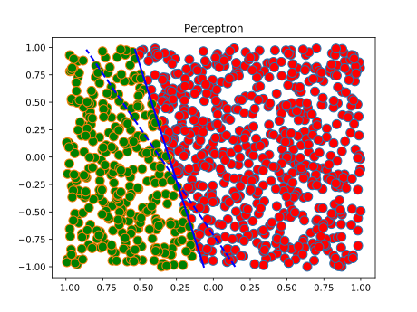 | 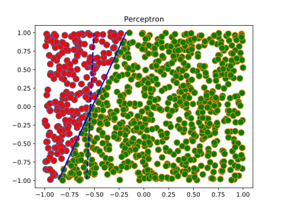 | 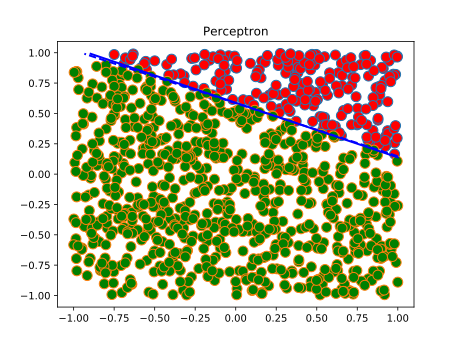 | 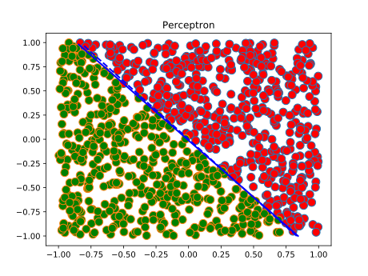 |

当维度较小时，增加维度能显著提高效果，但较大的维度也会大大增加运行时间，由于20的时候效果已经较好了，且再提升维度效果改善也并不显著，因此取20为下一实验的维度。

**500次迭代下不同划分的实验结果(维度为20)**

| No_train/No_test                                    | **1:9**                                             | **2:8**                                             | **3:7**                                             | **4:6**                                             |
| --------------------------------------------------- | --------------------------------------------------- | --------------------------------------------------- | --------------------------------------------------- | --------------------------------------------------- |
| train_err/test_err                                  | 0.306/0.98                                          | 0.398/0.958                                         | 0.446/0.918                                         | 0.452/0.892                                         |
| Result                                              | 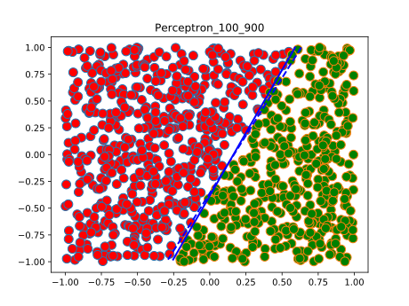 | 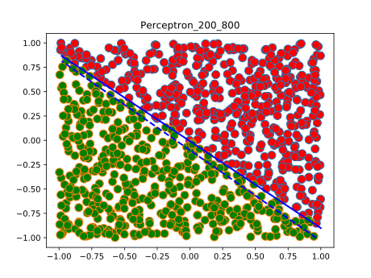 | 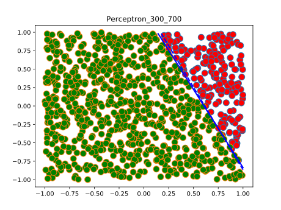 | 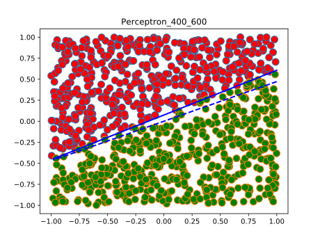 |
| **5:5**                                             | **6:4**                                             | **7:3**                                             | **8:2**                                             | **9:1**                                             |
| 0.512/0.838                                         | 0.526/0.788                                         | 0.546/0.716                                         | 0.608/0.656                                         | 0.618/0.466                                         |
| 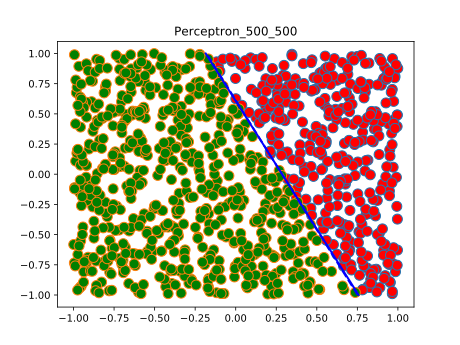 | 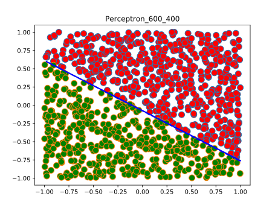 | 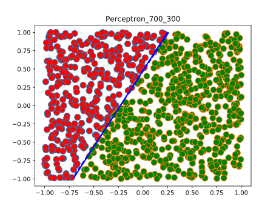 | 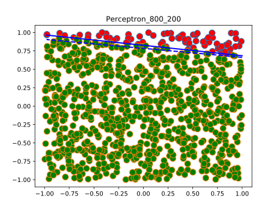 | 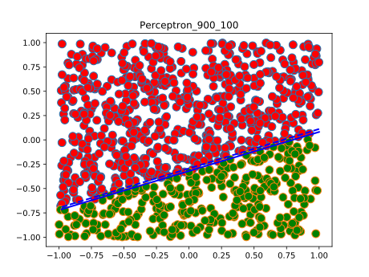 |

训练集与测试集的比例在7:3左右时效果不错且错误率较低，不过在合理范围内的划分的效果都区别不大。两者的错误率随着各自的占比的下降而下降。

### 总述

训练的效果：线性回归<低维感知机<SVM<高维感知机，且感知机有错误率较低的优势。