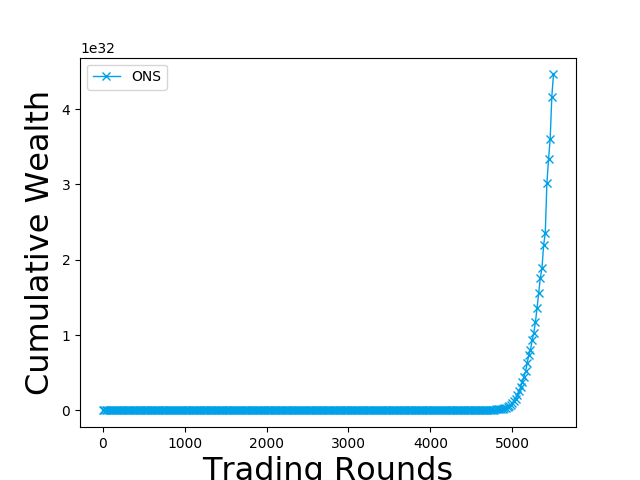

<center style = "font-size: 4em">金融科技导论实验报告</center><br/><br/><br/><br/>

**姓名**：<u>陈希尧</u>

**学号**：<u>3180103012</u>

**专业**：<u>计算机科学与技术</u>

**课程名称**：<u>金融科技导论</u>

<center style = "font-size: 1.7em">Table of Contents</center>

[TOC]

# 实验目的

* 学习投资组合基本流程
* 了解投资组合算法框架
* 实现经典投资组合策略

# 实验步骤

## 学习并理解框架

### 模型调用方法

需要先在`strategy.__init__`的`methods_config`方法中注册算法，注册时要为每个算法创建一个字典，键值的意义如下：

```
:param name: 算法名称
:param function: 算法所在的函数名称
:param duplicate: 实验重复次数
:param k: PBTS特有参数
:param stock_size: 一共有几只股票
:param portfolio_size: 每个组合有几只股票，若0则不限制
:param update_type: 更新类型，不同算法意义不同
```

例如要为EW算法创建一个字典：`EW = {"name": "EW", "function": "EW", "data_type": "density"}`，然后将字典加入`methods`列表中：`methods = [Best, EW, MV, EG, ONS]`，将其名字的字符串加入`methods_name`列表中：`methods_name = ["Best", "EW", "MV", "EG", "ONS"]`

### 结果的意义

实验的直接输出有四个参数，分别是如下含义

* **cumulative_wealth**
  
    * 累计财富，字面意思，在这里表示最后的财富总值相比于入场时财富总值的倍数
    
* **sharpe_ratio**

    * 夏普比率，表示的是投资单位在每承受一单位风险下所产生的超额收益，如实验中Best策略的1.38598就远高于EW策略的0.0666088
    * 计算公式：$\displaystyle SharpeRation = \frac{E(R_P) - R_f}{\sigma_P}$
        * $E(R_P)$：投资组合预期报酬率
        * $R_f$：无风险利率
        * $σ_P$：投资组合超额收益的标准差

* **volatility**

    * 指在具体时限，某投资组合变化值的标准偏差，常用来量化投资组合的风险及不确定性，如实验中Best策略的0.0368093就高于EW策略的0.00844834，表面Best策略下资产价值的波动性更大

    * 一般的时间长度为$T$（年）的一段时间内的波动率为$\sigma_T$，则年化波动率为$\sigma_T=\sigma\sqrt T$

    * 如果一种资产（如股票）在长度为P的一段时间内，日均的对数回报率的标准差为$\sigma_{SD}$，那么年化波动性为$\sigma = \frac{\sigma_{SD}}{\sqrt{T}}$

* **max_drawdown**

    * 指在选定周期内任一历史时点往后推，产品净值走到最低点时的收益率回撤的相对幅度的最大值，用来描述买入产品后可能出现的最糟糕的情况，本实验中Best和EW的最大回撤率分别为0.00599和0.365959，显然EW策略的最大亏损幅度会超过Best策略，这也与实际情况符合
    * 任意时刻$T$的回撤的定义为$\displaystyle D(T) = \frac{\max_{t \in (0, T)}X(t) - X(T)}{\max_{t \in (0, T)}X(t)} = 1 - \frac{X(T)}{\max_{t \in (0, T)}X(t)}$
    * 最大回撤为买入产品后至$T$时刻的回撤的最大值，即$\displaystyle MD(T) = \max_{\tau \in (0, T)}D(\tau) = \max_{\tau \in (0, T)}[1 - \frac{X(\tau)}{\max_{t \in (0, \tau)}X(t)}]$

## 算法实现

### MV

根据马克维茨投资组合理论，投资组合的收益和风险分别为$\displaystyle E(R_P) = \sum_{i=1}^n w_iE(R_i)$和$\displaystyle \sigma_P^2 = \sum_{i=1}^n\sum_{j=1}^n w_i w_j {\rm cov}(R_i, R_j)$，而最佳投资组合点是投资者效用无差异曲线和资产有效边界的交点。这里需要使用cvxopt包的凸优化计算工具进行最佳组合的计算，cvxopt.solvers.qp的函数声明如下：

```python
(function) qp: (P, q, G=None, h=None, A=None, b=None, solver=None, kktsolver=None, initvals=None, **kwargs) -> dict[str, Any] | None
Solves a quadratic program

minimize    (1/2) * x’ * P * x + q’ * x
subject to  G*x <= h
            A*x = b.
```

以此实现MV算法:

```python
def MV_weight_compute(n, context):
    P = 2 * matrix(np.cov(context["R"].T))
    q = -1 * matrix(np.mean(context["R"].T, axis=1))
    G = -1 * matrix(np.eye(n))
    h = matrix(0.0, (n, 1))
    A = matrix(1.0, (1, n))
    b = matrix(1.0)

    solvers.options['show_progress'] = False
    sol = solvers.qp(P, q, G, h, A, b)
    w = np.array(sol['x']).T[0]

    return w
```

### EG

首先需要注意的是由于此模型和下面的ONS模型都是基于资本增长理论的，所以在计算权值时除了市场和投资产品本身的数据，还需要旧的权重信息，因此要稍微修改一下"\_\_init\_\_.py"中的接口：

```python
def runPortfolio(stocks, portfolio, method, dataset):
    ...
    wk = np.array([1/n for i in range(n)], dtype=np.float64)
    for k in range(dataset["span_t"] - 1 + dataset["init_t"], m, 1):
        ...
        if method["function"] == "EG":
            wk = weight_compute(n, context, wk)
        ...
```

仔细阅读论文之后根据公式$\displaystyle w_i^{t+1} = \frac{w_i^t \exp(\eta x_i^t/\vec w^t \cdot \vec x^t)}{\sum_{j=1}^N w_j^t \exp(\eta x_j^t/\vec w^t \cdot \vec x^t)}$实现模型，基本实现如下：

```python
def EG_weight_compute(n, context, w_pre=None, eta=0.05):
    x_k = np.array(context["Rk"])
    grad_k = - x_k / np.dot(w_pre, x_k)
    
    w_k = w_pre * np.exp(-eta * grad_k)
    w_k = w_k / np.sum(w_k)
    return w_k
```

但是这样子在η较大的时候会遇上`RuntimeWarning: overflow encountered in exp: w_k = w_pre * np.exp(-learning_rate * grad_k)`和`RuntimeWarning: invalid value encountered in true_divide: grad_k = - diff / np.dot(w_pre, diff)`的warning，然后结果中EG这一项全部是NaN。经过调试，我发现这是因为在Exponential Gradient的过程中，只有某一项会接近1（0.999...这样子），而其他都是非常小的数，基本上是在$10^{-30}$之下的，有些甚至小到float64无法表示。我一开始以为是数据的问题（弄错了R和P）导致了这种极端的情况的出现，后来经过再次反复比对发现那个接近1的股票正是收益最好的那一只（即Best策略的选股），因此只要在这种情况加上一个Best的修正就可以了，补充如下：

```python
if np.isnan(w_k).any():
    w_k = np.zeros(n)
    w_k[np.argmax(context["Rk"])] = 1
```

### ONS

同EG一样，也要先对`runPortfolio`方法进行修改，不同之处是要将Ak_inv一起传参：

```python
def runPortfolio(stocks, portfolio, method, dataset):
    ...
    wk = np.array([1/n for i in range(n)], dtype=np.float64)
    Ak_inv = (1 / 0.125) * np.eye(n)
    for k in range(dataset["span_t"] - 1 + dataset["init_t"], m, 1):
        ...
        if method["function"] == "ONS":
            wk, Ak_inv = weight_compute(n, context, wk, Ak_inv)
        ...
```

然后实现方法，同样要加上对于浮点数溢出的修正：

```python
def proj_netwon(A, y):
    n = A.shape[0]
    x = cvxpy.Variable(n)
    objective = cvxpy.Minimize(cvxpy.quad_form(x - y, A))
    constraints = [x >= 0, cvxpy.sum(x) == 1]
    prob = cvxpy.Problem(objective, constraints)
    prob.solve()
    return x.value


def ONS_weight_compute(n, context, w_pre, Ak_inv, eta=0.02, epsilon=0.125):
    x_k = np.array(context["Rk"])
    w_k = w_pre
    Ak = epsilon * np.eye(n)
    grad_k = - x_k / np.dot(w_k, x_k)
    hess_k = np.outer(grad_k, grad_k)
    Ak += hess_k
    Ak_inv -= Ak_inv.dot(hess_k).dot(Ak_inv) / \
        (1 + grad_k.dot(Ak_inv).dot(grad_k))
    w_k = proj_netwon(Ak, w_k - eta * Ak_inv.dot(grad_k))
    # if np.isnan(w_k).any():
    #     w_k = np.zeros(n)
    #     w_k[np.argmax(context["Rk"])] = 1
    return w_k, Ak_inv
```

# 实验结果

## 参数η对增长理论算法的影响

调节参数η（learning rate）对EG和ONS这两种基于资本增长理论的算法影响如下：

**EG**

| η (learning rate) | 0.05                             | 0.5                             | 5                             | 50                             |
| ----------------- | -------------------------------- | ------------------------------- | ----------------------------- | ------------------------------ |
| cumulative_wealth | 24.3678                          | 68.9305                         | 296016                        | 5.48905e+07                    |
| sharpe_ratio      | 0.0682348                        | 0.0806937                       | 0.0890694                     | 0.0961849                      |
| volatility        | 0.00849269                       | 0.00952086                      | 0.0256901                     | 0.0336678                      |
| max_drawdown      | 0.361127                         | 0.363275                        | 0.51108                       | 0.595523                       |
| wealth graph      |      |      |      |      |
| weight graph      |  |  |  |  |

**ONS**

| η (learning rate) | 0                              | 0.02                              | 0.2                              | 2                              |
| ----------------- | ------------------------------ | --------------------------------- | -------------------------------- | ------------------------------ |
| cumulative_wealth | 22.2183                        | 97.6852                           | 6.55122e+06                      | 4.79761e+32                    |
| sharpe_ratio      | 0.0666088                      | 0.0859513                         | 0.272893                         | 0.739028                       |
| volatility        | 0.00844834                     | 0.00967499                        | 0.0104492                        | 0.0185998                      |
| max_drawdown      | 0.365959                       | 0.364068                          | 0.162216                         | 0.0682583                      |
| wealth graph      |      |      |      |      |
| weight graph      |  |  |  |  |

综上进行分析，当learning rate较小时，算法效果趋近于EW策略，当learning rate不断增大算法效果趋向于Best策略，这从weight图和结果都可以看出。

从理论的角度进行考虑，在当前的w_k离最佳的权重组合w\*（即Best策略下的权重）较远时，较大的learning rate能帮助w_k快速地向w\*收敛，但遇到了w_k离w\*较近的情况，较大的learning rate就会导致过拟合，反而使最后的结果变差。

从实际市场表现来看，虽然提高learning rate可以有效提高财富总量，但是同样的，资产的波动性不断上升，表明这种投资组合方式的风险对应上升，与我们最初规避风险的初衷不符合，因此learning rate不宜选取过大。

## 不同模型的对比

选取了EG中η=0.05，ONS中η=0.02，ε=0.125的参数进行比较，获得了如下结果：


| **Algorithm**                       | **Best**                              | **EW**                               |
| ----------------------------------- | ------------------------------------- | ------------------------------------ |
| **cumulative_wealth**               | 1.29818e+119 | 22.2183 |
| **sharpe_ratio**                    | 1.38598 | 0.0666088 |
| **volatility**                      | 0.0368093 | 0.00844834 |
| **max_drawdown**                    | 0.00599 | 0.365959 |
| **wealth graph**                    |                                       |               |
| **weight graph**                    |  |   |
| **MV** | **EG** | **ONS** |
| 3.72646 | 24.3678 | 97.6852 |
| 0.00915444 | 0.0682348 | 0.0859513 |
| 0.0260728 | 0.00849269 | 0.00967499 |
| 0.910088 | 0.361127 | 0.364068 |
|                |           |           |
|  |    |  |

### 分析

以下从四个指标分别分析五种模型各自的优势

* **cumulative_wealth**
    * | **Algorithm**         | Best         | EW      | MV      | EG      | ONS     |
        | --------------------- | ------------ | ------- | ------- | ------- | ------- |
        | **cumulative_wealth** | 1.29818e+119 | 22.2183 | 3.72646 | 24.3678 | 97.6852 |
    * 最终的累计资金排名是：`Best >> ONS > EG > EW > MV`，由于Best是上帝视角的投资策略，因此没有很大的考虑意义，ONS会略高一些（比EW和EG高几倍），但是MV反而比最无脑的EW还要低，这也说明了改进算法在实际市场上不一定能获得比简单算法更高的效益。
* **sharpe_ratio**
    * | **Algorithm**    | Best    | EW        | MV         | EG        | ONS       |
        | ---------------- | ------- | --------- | ---------- | --------- | --------- |
        | **sharpe_ratio** | 1.38598 | 0.0666088 | 0.00915444 | 0.0682348 | 0.0859513 |
    * 夏普指数的排名是：`Best >> ONS > EG ≈ EW >> MV`，EW、EG、ONS在相同风险下获得的收益在一个数量级上，但是ONS会略大于另外两者，在市场风险较大的时候可以选用该投资方法；MV的话比这三者小了一个数量级，也说明了这个模型的利润实际上是较低的。但这些算法同Best相比都差了好几个数量级，这也说明当前的投资组合算法在给定风险的情况下都还有较大的利润上涨空间。
* **volatility**
  
    * | **Algorithm**  | Best      | EW         | MV        | EG         | ONS        |
        | -------------- | --------- | ---------- | --------- | ---------- | ---------- |
        | **volatility** | 0.0368093 | 0.00844834 | 0.0260728 | 0.00849269 | 0.00967499 |
    * 波动性的排名是：`Best > MV >> ONS > EG ≈ EW`，Best的收益非常高，风险较高也正常，因为其快速增长需要较大的资产波动来支持，但是收益最低的MV也和Best有着同个数量级的波动，说明其波动单纯是因为亏损的幅度较大导致的（从图中也能看出）；EW、EG、ONS的波动性很低，这导致了他们的最终财富不会太高，但是这也避免了他们资产短时间内大幅缩水。从这些我们可以看出，最好的波动性并不是绝对大或者绝对小的，而是要在确保风险较低的情况下尽可能大，并且要保证这个大的波动是获利而不是亏损导致的。
* **max_drawdown**
    * | **Algorithm**    | Best    | EW       | MV       | EG       | ONS      |
        | ---------------- | ------- | -------- | -------- | -------- | -------- |
        | **max_drawdown** | 0.00599 | 0.365959 | 0.910088 | 0.361127 | 0.364068 |
    * 最大回撤率的排名是：`Best << ONS ≈ EW ≈ EG < MV`，Best的最大回撤率比其他的小了两个数量级，且其他的差不多，这说明在无法预测未来的情况下，每个人会遇到的最大亏损其实都比较严重的（都在36%以上），但是MV的最大回撤率达到了91%，这是在爆仓的边缘疯狂试探，这也再次提醒人们股票市场的巨大风险

从这四个指标来看，ONS都是平衡了风险与收益的最佳算法，因此在NYSE数据集中选择ONS算法是这几个算法中最好的选择。

# Bonus：模型的数学推导

## EG

**递推式的证明**

$$
{
    目的：使F(\vec w ^{t+1}) = \eta \log(\vec w ^{t+1} \cdot \vec x ^t) - d(\vec w^{t+1}, \vec w^t)取得最大值，
    \\
    其中d函数是将\vec w ^{t+1}控制接近于\vec w ^{t}的函数，这这里的推导中使用如下函数：
    \\
    d(\vec w^{t+1}, \vec w^t) = D_{RE}(\vec w^{t+1} || \vec w^t) \overset{\triangle}{=} \sum_{i=1}^{N} \vec w^{t+1} \log \frac{\vec w^{t+1}}{\vec w^{t}}
    \\
    1)\ 由于F对\vec w^{t+1}有非线性的依赖（变量在\log()中），因此这个式子不好以\vec w^{t+1}作为变量求最值。
    \\
    所以需要对其进行近似变换：对第一项进行一阶泰勒展开（以\vec w ^{t+1}为自变量在\vec w ^{t}处展开，舍弃余项），即：
    \\
    \eta \log(\vec w ^{t+1} \cdot \vec x ^t) = \eta (\log(\vec w ^{t} \cdot \vec x^t) + \frac{\vec x^t \cdot(\vec w^{t+1} - \vec w^t)}{w^t \cdot \vec x^t})
    \\
    2)\ 利用概统中学习的拉格朗日乘数法求F的最大值，写出拉格朗日函数（有N+1个自变量：w_0~w_N, \lambda）：
    \\
    L(\vec w^{t+1}, \gamma) = F + \lambda\phi = \eta (\log(\vec w ^{t} \cdot \vec x^t) + \frac{\vec x^t \cdot(\vec w^{t+1} - \vec w^t)}{w^t \cdot \vec x^t}) + \lambda(\sum_{i=1}^N w_i^{t+1} - 1)，
    \\
    其中\phi=0即\sum_{i=1}^N w_i^{t+1} = 1是投资组合购买权重之和为1的限制条件
    \\
    根据拉格朗日乘数法的定义，对每个自变量w_i^{t+1}求偏导使其为0得到方程：
    \\
    \eta \frac{x_i^t}{\vec w^t \cdot \vec x^t} - (\log\frac{w_i^{t+1}}{w_i^t}) + \lambda = 0
    \Longrightarrow
    w_i^{t+1} = w_i^t \exp(\eta\frac{x_i^t}{\vec w^t \cdot \vec x^t} + \lambda - 1)
    \\
    3)\ 又\because \sum_{i=1}^N w_i^{t+1} = 1 = \frac{\sum_{i=1}^N w_i^t \exp(\eta x_i^t/\vec w^t \cdot \vec x^t)}{\sum_{j=1}^N w_j^t \exp(\eta x_j^t/\vec w^t \cdot \vec x^t)} = \sum_{i=1}^N\frac{ w_i^t \exp(\eta x_i^t/\vec w^t \cdot \vec x^t)}{\sum_{j=1}^N w_j^t \exp(\eta x_j^t/\vec w^t \cdot \vec x^t)}
    \\
    \therefore w_i^{t+1} = \frac{w_i^t \exp(\eta x_i^t/\vec w^t \cdot \vec x^t)}{\sum_{j=1}^N w_j^t \exp(\eta x_j^t/\vec w^t \cdot \vec x^t)}
}
$$

**regret的证明**

太多了，用手写的，图片在下一页


