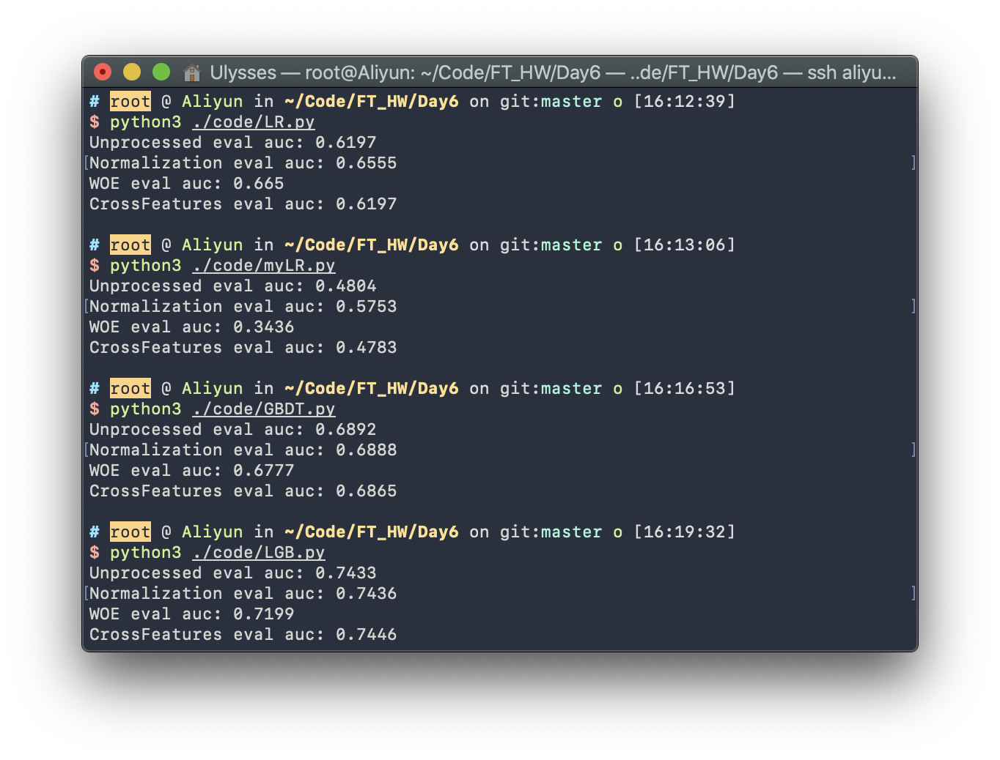

<center style = "font-size: 4em">金融科技导论实验报告</center><br/><br/><br/><br/>

**姓名**：<u>陈希尧</u>

**学号**：<u>3180103012</u>

**专业**：<u>计算机科学与技术</u>

**课程名称**：<u>金融科技导论</u>

<center style = "font-size: 1.7em">Table of Contents</center>

[TOC]

# 数据分析

代码见"Analysis_Preprocess.ipynb"

## 特征关联性

**关联性热力图：**

```python
corr_map = data.corr()
plt.figure(figsize=(20, 20))
mask = np.triu(np.ones_like(corr_map, dtype=np.bool))
cmap = sns.diverging_palette(150, 275, s=80, l=55, n=12)
sns.heatmap(corr_map, mask=mask, cmap=cmap, square=True, linewidths=.5)
plt.savefig('../assets/corr.svg', format='svg')
```


从中看到大部分数据之间的关联性较小，而所有数据与Y的关联性都很小（没有超过0.25的）

进而**找出与Y关联性较大的特征**：

```python
In []:
data.corr()['Y'].where(abs(data.corr()['Y']) > 0.12).drop(labels=['Y']).dropna()

Out[]:
X14   -0.128984
X16   -0.140307
X22    0.145208
X25   -0.146208
X27   -0.244145
X30   -0.164431
X34    0.141244
X42   -0.151542
Name: Y, dtype: float64
```

## WOE/IV

数据分箱与WOE/IV值计算的方法实现在Notebook中，调用该方法，由于在计算过程中有打乱数据，因此要对IV及逆行重排：

```python
final_iv, IV = data_vars(data, data.Y)
IV = IV.set_index('VAR_NAME').loc[[('X' + str(i)) for i in range(1, 73)]].reset_index()
```

获得的iv表如下：


iv可视化：

```python
plt.figure(figsize=(30,15))
sns.catplot(x='VAR_NAME', y='IV', data=IV, aspect=4)
plt.savefig('../assets/iv.svg', format='svg')
```


挑出IV值较大的并按大小排序，便于之后特征交叉处理：

```python
In []:
IV.where(IV > 0.1).dropna().sort_values(by='IV', ascending=False)

Out[]:
| VAR_NAME |    IV    |
| -------- | -------- |
|    X27   | 0.248032 |
|    X30   | 0.180453 |
|    X16   | 0.151433 |
|    X34   | 0.147362 |
|    X22   | 0.140866 |
|    X24   | 0.123124 |
|    X42   | 0.119806 |
|    X69   | 0.113160 |
|    X25   | 0.107627 |
|    X21   | 0.102219 |
```

# 特征工程

## 归一化

归一化，即将所有量值统一变成标准化的量值$\frac{X_i - \overline X}{\sqrt{\sum\limits_{i=1}^{N}\frac{(X_{i}-\overline X)^{2}}{N}}}$，需要注意的是非量参数和Y不能参与标准化，因此要提前排除：

```python
In []:
digital_cols = data.dtypes[data.dtypes != 'object'].index
nor_data = data.copy()
digital_cols = digital_cols[digital_cols != 'Y']
nor_data[digital_cols] = nor_data[digital_cols].apply(lambda x: (x - x.mean()) / (x.std()))
nor_data.head(10)

Out[]:
| X1        | X2        | X3        | ...  | X71       | X72       | Y         |
| --------- | --------- | --------- | ---- | --------- | --------- | --------- |
| 1.029154  | 0.538781  | 5.607751  | ...  | -0.070304 | -0.017537 | 1.276128  |
| -1.044798 | -1.042146 | -0.473350 | ...  | NaN       | NaN       | 1.276128  |
| -1.044798 | 0.010060  | -0.423590 | ...  | -0.070304 | -0.017537 | -0.783605 |
| 1.325433  | 0.460258  | -0.245518 | ...  | -0.070304 | -0.017537 | 1.276128  |
| -1.044798 | 0.063717  | -0.378450 | ...  | -0.070304 | -0.017537 | -0.783605 |
| 0.140318  | -0.453225 | -0.463398 | ...  | -0.070304 | -0.017537 | -0.783605 |
| 0.732876  | -0.215039 | 0.429449  | ...  | -0.070304 | -0.017537 | -0.783605 |
| 0.140318  | -0.281783 | 2.455772  | ...  | -0.070304 | -0.017537 | -0.783605 |
| -1.637355 | 0.889516  | 1.552262  | ...  | -0.070304 | -0.017537 | 1.276128  |
| 0.436597  | 0.894751  | 1.758768  | ...  | -0.070304 | -0.017537 | -0.783605 |
```

## WOE编码

实现详见Notebook，结果如下：

```python
Out[]:
| new_X1    | new_X2    | new_X3    | ...  | new_X71   | new_X72   | Y    |
| --------- | --------- | --------- | ---- | --------- | --------- | ---- |
| -0.068786 | -0.154690 | 0.027518  | ...  | -0.012368 | -0.021207 | 1    |
| -0.030204 | 0.200656  | -0.045969 | ...  | -0.012368 | -0.021207 | 1    |
| -0.030204 | -0.060556 | -0.045969 | ...  | -0.012368 | -0.021207 | 0    |
| -0.068786 | -0.154690 | 0.027518  | ...  | -0.012368 | -0.021207 | 1    |
| -0.030204 | -0.060556 | 0.027518  | ...  | -0.012368 | -0.021207 | 0    |
| -0.066038 | -0.016527 | -0.045969 | ...  | -0.012368 | -0.021207 | 0    |
| -0.068786 | -0.060556 | 0.027518  | ...  | -0.012368 | -0.021207 | 0    |
| -0.066038 | -0.016527 | 0.027518  | ...  | -0.012368 | -0.021207 | 0    |
| -0.030204 | -0.154690 | 0.027518  | ...  | -0.012368 | -0.021207 | 1    |
| -0.066038 | -0.154690 | 0.027518  | ...  | -0.012368 | -0.021207 | 0    |
```

## 特征交叉

特征交叉的实现如下：

```python
def add_cross_feature(data, feature_1, feature_2):
    comb_index = data[[feature_1, feature_2]].drop_duplicates()
    comb_index[feature_1 + '_' + feature_2] = np.arange(comb_index.shape[0])
    data = pd.merge(data, comb_index, 'left', on=[feature_1, feature_2])
    return data
```

挑出之前IV值最高的三个，进行分箱，然后分别进行特征交叉

```python
cross_data = data.copy()
cross_data.X16 = pd.qcut(cross_data.X16, q=10, duplicates='drop')
cross_data.X27 = pd.qcut(cross_data.X27, q=10, duplicates='drop')
cross_data.X30 = pd.qcut(cross_data.X30, q=10, duplicates='drop')
cross_data = add_cross_feature(cross_data, 'X27', 'X30')
cross_data = add_cross_feature(cross_data, 'X27', 'X16')
cross_data = add_cross_feature(cross_data, 'X16', 'X30')
```

# 模型训练

## LR

```python
file_list = [('Unprocessed', './data/train_raw.csv', './data/test_raw.csv'), ('Normalization', './data/train_nor.csv', './data/test_nor.csv'),
             ('WOE', './data/train_woe.csv', './data/test_woe.csv'), ('CrossFeatures', './data/train_cross.csv', './data/test_cross.csv')]

if __name__ == "__main__":
    for f_name, train_file, test_file in file_list:
        raw_train = pd.read_csv(train_file).astype('float')
        raw_test = pd.read_csv(test_file).astype('float')

        train_X = raw_train.drop(
            columns=['Y'] + exclude_attr)
        test_X = raw_test.drop(
            columns=['Y'] + exclude_attr)

        LR = LogisticRegression(max_iter=1000)
        LR.fit(train_X, raw_train['Y'])
        print(f_name, 'eval auc:', LR.score(test_X, raw_test['Y']))
```

## GBDT

```python
file_list = [('Unprocessed', './data/train_raw.csv', './data/test_raw.csv'), ('Normalization', './data/train_nor.csv', './data/test_nor.csv'),
             ('WOE', './data/train_woe.csv', './data/test_woe.csv'), ('CrossFeatures', './data/train_cross.csv', './data/test_cross.csv')]

if __name__ == "__main__":
    for f_name, train_file, test_file in file_list:
        raw_train = pd.read_csv(train_file).astype('float')
        raw_test = pd.read_csv(test_file).astype('float')

        train_X = raw_train.drop(
            columns=['Y'] + exclude_attr)
        test_X = raw_test.drop(
            columns=['Y'] + exclude_attr)

        LR = GradientBoostingClassifier(loss='deviance', learning_rate=0.3)
        LR.fit(train_X, raw_train['Y'])
        print(f_name, 'eval auc:', LR.score(test_X, raw_test['Y']))
```

## LGB

```python
file_list = [('Unprocessed', 'raw'), ('Normalization', 'nor'), ('WOE', 'woe'), ('CrossFeatures', 'cross')]

class RiskModel():
    def __init__(self, data_path, ftype):
        self.data_path = data_path
        self.train, self.test, self.param = self.__construct_dataset(ftype)

        # self.train = self.train.drop(columns=['Unnamed: 0', 'id'] + exclude_attr)
        # self.test = self.test.drop(columns=['Unnamed: 0', 'id'] + exclude_attr)

        self.feature_name = [i for i in self.train.columns if i not in ['Y']]
        # print('train set:', self.train.shape, ', ', 'test set:', self.test.shape)
        self.lgb_train = lgb.Dataset(data=self.train[self.feature_name],
                                     label=self.train['Y'],
                                     feature_name=self.feature_name,
                                     silent=True)
        self.lgb_test = lgb.Dataset(data=self.test[self.feature_name],
                                    label=self.test['Y'],
                                    feature_name=self.feature_name,
                                    silent=True)
        self.evals_result = {}
        self.gbm = None

    def __construct_dataset(self, ftype):
        train = pd.read_csv(self.data_path + 'train_' + ftype + '.csv')
        test = pd.read_csv(self.data_path + 'test_' + ftype + '.csv')

        train = train.astype('float')
        test = test.astype('float')

        param = dict()
        param['verbose'] = -1
        param['objective'] = 'binary'
        param['boosting_type'] = 'gbdt'
        param['metric'] = 'auc'
        param['verbose'] = 0
        param['learning_rate'] = 0.10
        param['max_depth'] = 5
        param['feature_fraction'] = 0.8
        param['bagging_fraction'] = 0.8
        param['bagging_freq'] = 1
        param['num_leaves'] = 30
        param['min_data_in_leaf'] = 64
        param['is_unbalance'] = False
        param['verbose'] = -1

        return train, test, param

    def fit(self):
        self.gbm = lgb.train(self.param,
                             self.lgb_train,
                             early_stopping_rounds=10,
                             num_boost_round=1000,
                             evals_result=self.evals_result,
                             valid_sets=[self.lgb_train, self.lgb_test],
                             verbose_eval=False)

    def evaluate(self):
        test_label = self.test['Y']
        prob_label = self.gbm.predict(self.test[self.feature_name])
        auc = sklearn.metrics.roc_auc_score(test_label, prob_label)
        return auc

if __name__ == "__main__":
    for f_name, ftype in file_list:
        MODEL = RiskModel(data_path='./data/', ftype=ftype)
        MODEL.fit()
        print(f_name, 'eval auc:', str(MODEL.evaluate())[:6])

        raw_for_pred = pd.read_csv('../Day2/data/test_new.csv')
        for_pre = raw_for_pred.drop(columns=['id'] + exclude_attr)
        pd.DataFrame({'id': raw_for_pred['id'], 'pre': MODEL.gbm.predict(for_pre)}) \
            .to_csv("./3180103012_pre.csv")
```

## LR的实现

```python
class myLogisticRegression:
    def __init__(self):
        self.w = None

    @staticmethod
    def sigmoid(x):
        return 1 / (1 + np.exp(-x))

    @staticmethod
    def sigmoid_gradient(x):
        return myLogisticRegression.sigmoid(x) * (1 - myLogisticRegression.sigmoid(x))

    @staticmethod
    def ones_augment_to_left(X):
        X = np.array(X)
        ones = np.ones(X.shape[0])
        return np.column_stack([ones, X])

    @staticmethod
    def logistic_gradient_descent(X, y, n_iters=10000, alpha=0.05, weight=None):
        w = weight
        if w is None:
            w = np.random.rand(X.shape[1])
            w = np.ones(X.shape[1])
        pass

        for i in range(1, n_iters + 1):
            y_pred = myLogisticRegression.sigmoid(X.dot(w))
            loss = y_pred - y

            grad = myLogisticRegression.sigmoid_gradient(
                loss.dot(X) / X.shape[0])
            w = w - alpha * grad
        return w

    def fit(self, X_train, y_train, **kwargs):
        X = self.ones_augment_to_left(X_train)
        y = np.array(y_train)
        self.w = self.logistic_gradient_descent(X, y, **kwargs)

        return self

    def predict(self, X_test):
        X_test = np.array(X_test)
        augX_test = self.ones_augment_to_left(X_test)
        return augX_test.dot(self.w)

    def score(self, X, Y):
        y_pred = self.predict(X)
        return(roc_auc_score(Y, np.round(y_pred)))
```

# 实验结果

## 结果分析



| Feature\Model | LR     | myLR   | GBDT   | LGB    |
| ------------- | ------ | ------ | ------ | ------ |
| Unprocessed   | 0.6197 | 0.4804 | 0.6892 | 0.7433 |
| Normalization | 0.6555 | 0.5753 | 0.6888 | 0.7436 |
| WOE           | 0.665  | 0.3436 | 0.6777 | 0.7199 |
| CrossFeatures | 0.6197 | 0.4783 | 0.6865 | 0.7446 |

从结果中可以看出，大致的预测效果是LGB>GBDT>LR，其中归一化能对LR算法有明显的优化作用，对于其他两个则作用不明显；WOE对LR也能大幅优化，但是对与其他两个会是负优化；而特征交叉在三个算法中的作用都不明显（我将特征交叉数从1改为3之后的变化也局限在小数点后第三位）。同时，自己实现的LR算法仅在归一化下较好，其他情况较为糟糕，可能是缺乏sklearn中自动参数调节的实现导致的，而手动调参又非常麻烦。


根据[数据分析](# 数据分析)中的分析，对预测较重要的特征主要有`X14, X16, X21, X22, X24, X25, X27, X30, X34, X42, X69`

## 归一化的适用场景

在上面的模型中，归一化对于LR，特别是自己实现的LR，有明显的优化作用，而对梯度提升决策树BTDTT和它的改进算法LightGBM的优化效果十分有限。查阅资料，得到如下结论：

**适用归一化的场景：**

* **涉及或隐含距离计算的算法，比如K-means、KNN、PCA、SVM等，一般需要归一化**
    * **zero-mean一般可以增加样本间余弦距离或者内积结果的差异**，区分力更强，假设数据集集中分布在第一象限遥远的右上角，将其平移到原点处，可以想象样本间余弦距离的差异被放大了。在模版匹配中，zero-mean可以明显提高响应结果的区分度。
    * 就欧式距离而言，**增大某个特征的尺度，相当于增加了其在距离计算中的权重，如果有明确的先验知识表明某个特征很重要，那么适当增加其权重可能有正向效果，但如果没有这样的先验，或者目的就是想知道哪些特征更重要，那么就需要先归一化，对各维特征等而视之**。
    * 增大尺度的同时也增大了该特征维度上的方差，PCA算法倾向于关注方差较大的特征所在的坐标轴方向，其他特征可能会被忽视，因此，在PCA前做Standardization效果可能更好
* **梯度下降算法，需要归一化**
    * 梯度下降的参数更新公式为：$W(t+1)=W(t)−\eta\frac{dE(W)}{dW}$，$E(W)$为损失函数，收敛速度取决于：参数的初始位置到local minima的距离，以及学习率$\eta$的大小。
    * **zero center与参数初始化相配合，缩短初始参数位置与local minimum间的距离，加快收敛**。模型的最终参数是未知的，所以一般随机初始化，比如从0均值的均匀分布或高斯分布中采样得到，对线性模型而言，其分界面初始位置大致在原点附近，bias经常初始化为0，则分界面直接通过原点。同时，为了收敛，学习率不会很大。而每个数据集的特征分布是不一样的，如果其分布集中且距离原点较远，比如位于第一象限遥远的右上角，分界面可能需要花费很多步骤才能“爬到”数据集所在的位置。所以，无论什么数据集，先平移到原点，再配合参数初始化，可以保证分界面一定会穿过数据集。此外，**outliers常分布在数据集的外围**，与分界面从外部向内挪动相比，从中心区域开始挪动可能受outliers的影响更小。
    * 对于损失函数不是均方误差的情况，只要权重$w$与输入特征$x$间是相乘关系，损失函数对$w$的偏导必然含有因子$x$，$w$的梯度下降速度就会受到特征$x$尺度的影响。理论上为每个参数都设置上自适应的学习率，可以吸收掉$x$尺度的影响，但在实践中出于计算量的考虑，往往还是所有参数共用一个学习率，此时$x$尺度不同可能会导致不同方向上的下降速度悬殊较大，学习率不容易选择，下降过程也可能不稳定，通过scaling可对不同方向上的下降速度有所控制，使下降过程相对更稳定。

**不适用归一化的场景：**

* 与距离计算无关的概率模型，不需要归一化
* 与距离计算无关的数模型，需要归一化，比如决策树、随机森林等，树中节点的选择只关注当前特征在哪里切分对分类更好，即只在意特征内部的相对大小，而与特征间的相对大小无关。

