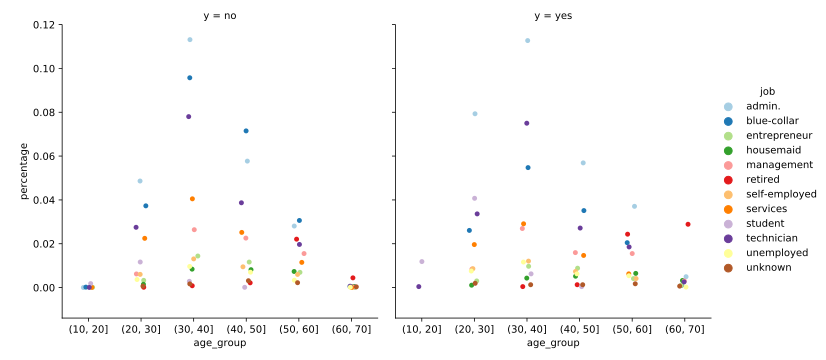
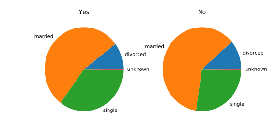
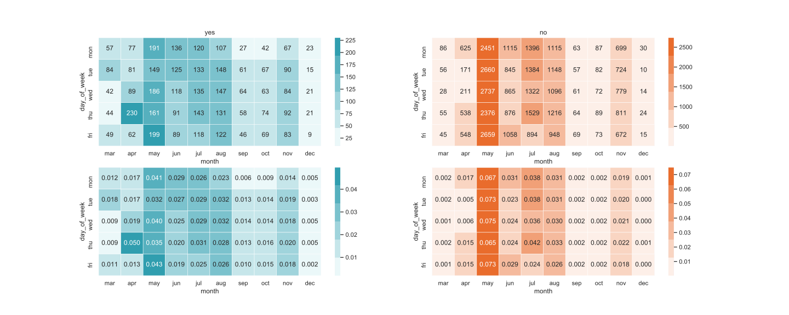

<center style = "font-size: 4em">金融科技导论实验报告</center><br/><br/><br/><br/>

**姓名**：<u>陈希尧</u>

**学号**：<u>3180103012</u>

**专业**：<u>计算机科学与技术</u>

**课程名称**：<u>金融科技导论</u>

<center style = "font-size: 1.7em">Table of Contents</center>

[TOC]

# 实验原理

## 金融营销的应用场景

金融营销是利用老客户（包括营销成功和营销失败）在日常生活中以及与公司的接触时产生的各种数据，建立分类器模型，从而尝试在未来预测不同类型客户的行为，以使公司的营销更为成功。例如在本次实验的数据中，仅有约11%的客户是被营销成功的，要是葡萄牙银行能够充分利用金融科技，就可以减少在营销失败率高的客户上花费的时间，而找到更多更容易接受营销的客户，从而大幅提高业务的精确性，使利润最大化。

除此之外，金融营销还能对营销员的营销行为产生一定的启示，例如在后面分析中所说的与客户接触时间对营销成功率的影响，以及与不同年龄段的客户的接触成功率最高的时间段等，这也鼓励营销员针对不同类型的客户进行个性化营销来提高业务的有效性。

## 金融营销与其他金融科技算法对比

金融营销主要目的是挖掘潜在客户，这要求对于数据的预处理，然后用模型训练出分类器，对训练集进行分类并且挖掘出测试集中的潜在客户。这其中最主要的就是数据预处理和分类算法的实现。

而对于其他本课程涉及的金融科技的场景。智能投顾主要是学习一些模型，然后用模型去匹配实际的股票市场数据，力求最大化收益最小化风险，主要的算法是投资组合算法；金融风控用到的技术与金融营销的比较类似，都是对用户信息进行挖掘和分析，并且最终要进行分类。只是金融风控和金融营销对于数据的要求和获取途径不同，最后进行的分类也有所不同：金融风控更倾向于二分类，而金融营销更需要多分类，因为用户是多样性的。当然风控也可以用连续性的指标，让用户去具体确定多少的指标要被判定为高风险。

# 数据可视化与客户分析

由于seaborn的图表在直观性和美观性上都远胜于原生的matplotlib，因此这里使用seaborn进行数据的分析。

**数据关联性**


在数据处理时用了mask将不相干的部分去掉。从图中可以看出涉及金钱的几个属性正关联性较高，previous属性（之前是否接受营销）与其他属性负关联性较大，其他的属性之间基本上都是弱关联。

**年龄**


由图表可以看出，接受调查的人年龄主要集中在20-60岁，且年轻人和老年人被营销成功的概率较大（相对于群体在不受营销的人群种的占比），而中年群体营销不成功比重大于成功比重。这可能与中年人普遍具有较固定的收入来源，具有更多的可支配资产，同时开销相对青年与⽼年群体也明显会更大。因此他们会更倾向于将资⾦投入利润较高的投资方案，或者更倾向于已使用过的较稳健的投资方案。

**工作**


被调查群体很多都是相对高收入人群（如管理人员、技术人员等），可见该公司的受众较为高端

**工作与年龄**



相比之下，退休人员和学生接受该银行推销的概率较大，这与年龄部分的结论相同；另外，不同职业的人群在不同年龄段受推销成功的概率会发生改变，例如管理人员（admin）在30\~40岁时比蓝领更难以接受推销，但到了40\~50岁就更容易被推销成功，这可能是与他们的职业心态有关。

**婚姻**



未婚人士相比单身人士更倾向于认购定期存款。这可能与未婚人士资金支配较为自由有关。同时，青年群体(<30)中可能未婚人士占据比例高于已婚人士，这也是⼀个影响因素。但是是否是离婚人士对于推销成功的影响不大。

**婚姻与年龄**


除了上述结论，这张图还能发现在单身时，年龄较小的更倾向于接受推销，婚后则相反，这可能与受众的恋爱心态有关，在未婚时会更愿意进行资本投资。

**教育**


由图表看出，文化水平较低者认购定期存款的比例最大，其次是文化水平较高者，认购比例随文化水平 增高先减⼩后增大。其中可能有两部分原因。文化水平较低者较易被营销人员说服，并且资⾦去向较少，因而会倾向于投入定期存款。随着文化水平的升高，人们会将资⾦投入收益更高处，例如股票证券等，减少在定期存款中的投入。而文化水平达到更高层次的人，通常具有比较繁忙的⽇常事务与工作，并且收入也会更高。这部分人会具有更多的资产，并且他们能投入到经营投资方案中的时间较少（股票证券等投资通常需要花费大量时间已达到更高收益），因而选择认购定期存款的比重会再次升高。


**接触的持续时长**


由图看出，与客服最后接触时间较⻓的客户更倾向于认购新产品，且在老年人身上花更多时间接触的效果更加明显。接触时间较⻓在⼀定程度上表明客户对此项投资方案具有较大兴趣，也可能对此机构具有较大好感。另外与青年人沟通似乎比较费劲，必须投入较多的时间，否则青年人一般都不会购买，但是一旦时间花够，青年人购买的概率会很大。


**接触时间**



本来以为这个和成功率没有什么关系，但是追究起来能发现很多有趣的点。首先是5月份的推销失败率远高于其他月份，甚至超过了其他月份之和，这也导致了为了使银行维持差不多的推销成功次数，必须要大大增大五月的推销的总次数。因此春夏季节成为了推销的高峰期，而秋冬季节会相对惨淡（1、2月停止营业），另外，银行在周一周二推销的次数会略高于其他三天，成功率也会略高一些（尚不清楚这是否与营销业务量更大有关）。

# 实验步骤

## 数据预处理和数据集分割

首先由于不同数值数据的大小不同，一起进行建模会使不同参数有不同权重，因此要对数据进行归一化（Normalization）

```python
digital_cols = data.dtypes[data.dtypes != 'object'].index
data[digital_cols] = data[digital_cols].apply(
    lambda x: (x - x.mean()) / (x.std()))
```

因为数据集的属性有很多特征并不是数值类型的，为了处理这样的数据，我们要对这些特征进⾏编码，可以利用pandas包的get_dummies()方法

离散特征的编码分为两种情况：

1. 离散特征的取值之间没有大⼩的意义，⽐如`color：[red, blue, green]`,那么就使⽤one-hot编码`{red: 100, blue: 010, green: 001}`
2. 离散特征的取值有大⼩的意义，⽐如`day_in_week: [mon, tue, wed]`,那么就使⽤数值的映射`{mon:1, tue:2, wed:3}`

分割的时候将训练集和测试机七三开，并且随机打乱：

```python
def split_data(data):
    y = data.y
    x = data.loc[:, data.columns != 'y']
    x = data_preprocess(x)
    x_train, x_test, y_train, y_test = train_test_split(
        x, y, test_size=0.3, random_state=1)
    return x_train, x_test, y_train, y_test
```

## 模型训练

利用实验三种实现的感知机权重函数可以实现基于感知机的分类器，需要注意在传参前要将yes和no处理成1和0并转化成一维的线性数据结构，如`list(y_train.map(dict(yes=1, no=0)))`，权重算法如下：

```python3
def func_per(X, y, dim=100):
    P, N = X.shape
    w = np.zeros((P+1, 1))
    for iD in range(dim):
        for iN in range(N):
            y_try = w[0][0]
            for iP in range(0, P):
                y_try += X[iP][iN] * w[iP+1][0]
            if((y_try * y[iN]) <= 0):  # Unmatch
                w[0][0] += y[iN]
                for iP in range(P):    # Update all weights
                    w[iP+1][0] += X[iP][iN] * y[iN]
    return w[1:P+1]
```

另外，由于sklearn有大量已实现的分类器，因此对于其他分类器效果的测试主要是调参，分类的框架如下：

```python
def predict_model(model, x_train, x_test, y_train):
    model.fit(x_train, y_train)
    y_pred = model.predict(x_test)
    return y_pred
```

使用的分类器和参数如下：

```python
LogisticRegression()
SVC(kernel='sigmoid', C=0.1)
KNeighborsClassifier(n_neighbors=15, weights='distance')
DecisionTreeClassifier(criterion='gini')
MLPClassifier(hidden_layer_sizes=(200, 200), solver='adam', shuffle=True)
XGBClassifier(learning_rate=0.3, max_depth=3)
RandomForestClassifier(n_estimators=200, criterion='gini')
AdaBoostClassifier()
GradientBoostingClassifier()
BaggingClassifier()
Perceptron()
```

# 实验结果

首先研究调用`classification_report()`方法获取yes和no的平均值，因为训练集种yes和no比例悬殊，约8:1，只研究yes的结果对于预测潜在客户没有很大的实际意义

| Model | Precision | Recall | F1 Score |
| --- | --- | --- | --- |
| Logistic Regression | 0.90 | 0.91 | 0.90 |
| SVM | 0.88 | 0.88 | 0.88 |
| Perceptron | 0.89 | 0.90 | 0.89 |
| KNN | 0.89 | 0.90 | 0.89 |
| Decision Tree | 0.89 | 0.89 | 0.89 |
| Multi-Layer Perceptron | 0.89 | 0.90 | 0.90 |
| XG Boost | 0.91 | 0.92 | 0.91 |
| Random Forest | 0.90 | 0.91 | 0.90 |
| Ada Boost | 0.90 | 0.91 | 0.90 |
| Gradient Boosting | 0.91 | 0.92 | 0.91 |
| Bootstrap Aggregating | 0.90 | 0.91 | 0.90 |

区分度不是很大，因此再考察yes的情况：

| Model | Precision | Recall | F1 Score |
| --- | --- | --- | --- |
| Logistic Regression | 0.66 | 0.42 | 0.51 |
| SVM | 0.48 | 0.41 | 0.44 |
| Perceptron | 0.55 | 0.46 | 0.50 |
| KNN | 0.65 | 0.37 | 0.47 |
| Decision Tree | 0.51 | 0.51 | 0.51 |
| Multi-Layer Perceptron | 0.55 | 0.49 | 0.52 |
| XG Boost | 0.66 | 0.53 | 0.59 |
| Random Forest | 0.67 | 0.43 | 0.52 |
| Ada Boost | 0.66 | 0.39 | 0.49 |
| Gradient Boosting | 0.66 | 0.53 | 0.59 |
| Bootstrap Aggregating | 0.62 | 0.46 | 0.53 |

在传统算法中，LR的结果相对比较优秀；SVM精确率和召回率都低，速度还慢，可以说是非常不理想的一种方法；感知机的精确度较差但召回率较高。

KNN的精确度还算挺高，但是查全率是最低的，这与预期有点不同，考虑到可能是因为no的人数是yes的好几倍，由于KNN

在剩下的算法中，GBDT和XGBoost的表现较优，两者的区别在于GBDT只用一阶导，而XGBoost用了二阶导。


